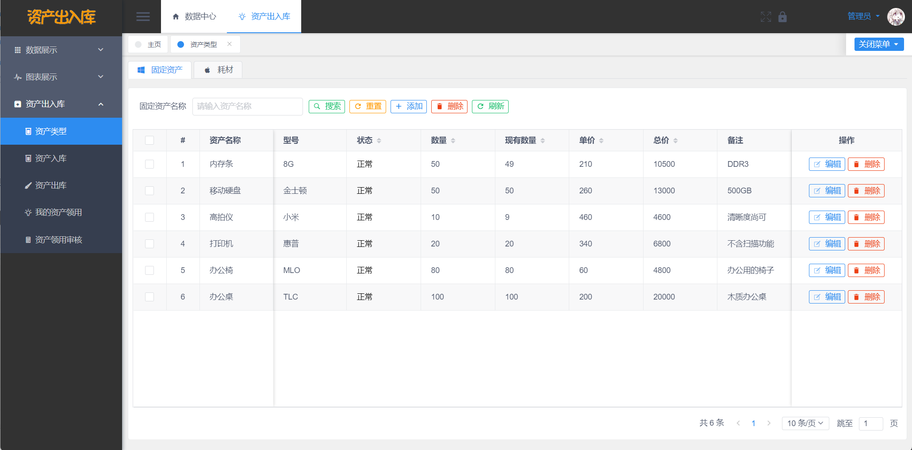

# 【前后端分离开发模板】基于 Vue 和 SpringBoot 的资产出入库管理系统

## 软件简介

本软件是基于Vue和SpringBoot的资产出入库管理系统，支持资产类型维护、资产入库、资产领用出库、资产出库审核这四大核心业务，适用于中小企业管理行政办公资产。系统给每个资产档案提供一个唯一标识，对物品入库、出库等各个作业环节进行快速批量的数据采集，确保中小企业及时掌握资产库存的真实数据，合理保持和控制企业库存。另外系统还包括员工管理、组织机构管理、文件管理、权限管理、图表分析功能，给中小企业提供更个性化的资产管理模式。

本系统采用了**基于角色的访问控制**，角色和菜单关联，一个角色可以配置多个菜单权限；然后再将用户和角色关联，一位用户可以赋予多个角色。这样用户就可以根据角色拿到该有的菜单权限，更方便中小企业管理人员进行权限管控。

本系统还**封装了文件管理功能**，在其他模块如若要实现图片/文件上传预览时，前端只需导入现成的 Vue 组件即可实现（使用 viewerjs 依赖实现），后端只需定义 String 类型的实体类变量即可，无需再去研究文件上传预览的相关功能，简化了开发者的工作量。

本系统还自带**基于 beetl 代码生成器**功能，开发者只需要输入类名（如 Student）和类备注（如学生），运行 main 函数即可自动生成后端的所有 MVC 结构代码，无需开发增删改查的 API 接口。对于前端，开发者只需输入后端实体类的完整路径，利用 Java 的反射原理，拿到后端实体类的字段，即可自动生成前端所有代码，生成的模块代码包含基础的增删改查功能，简化开发者的工作量。




## 免责声明

- 本项目开源，仅供个人学习使用，**转发 / 商用授权请联系作者，否则后果自负**。
- 作者拥有本软件构建后的应用系统全部内容所有权及独立的知识产权（**软件著作权登记号：2022SR1338865**）。
- 如有问题，欢迎在仓库 Issue 留言，看到后会第一时间回复。相关意见会酌情考虑，但没有一定被采纳的承诺或保证。

下载本系统代码的用户，**必须同意以下内容，否则请勿下载**！

1. 出于自愿而使用/开发本软件，了解使用本软件的风险，且同意自己承担使用本软件的风险。
2. 利用本软件构建的网站的任何信息内容以及导致的任何版权纠纷和法律争议及后果和作者无关，作者对此不承担任何责任。
3. 在任何情况下，对于因使用或无法使用本软件而导致的任何难以合理预估的损失（包括但不仅限于商业利润损失、业务中断与业务信息丢失），作者概不承担任何责任。
4. 必须了解使用本软件的风险，作者不承诺提供一对一的技术支持、使用担保，也不承担任何因本软件而产生的难以预料的问题的相关责任。

## 软件技术选型

### 前端

lVue：Vue 是构建前端界面的核心框架，本系统采用 2.6.14 版本。

View UI：基于 Vue.js 2 的组件库，本系统采用 4.7.0 版本。

### 后端

- Spring Boot：构建系统核心逻辑的后端框架，本系统采用 2.7.3 版本。
- MyBatis Plus：后端连接数据库的框架，本系统采用 3.5.2 版本。

### 数据库

- MySQL：本项目的主数据库，本系统采用 8.0.30 版本。
- Redis：本系统采用基于 Windows 版本的 Redis，用于图形验证码和用户菜单权限的临时存储，采用了 5.0.14.1 版本。

### 开发环境

- VsCode：项目前端的开发工具，使用版本为 1.68.0。
- IntelliJ IDEA ：项目后端的开发工具，使用版本为 2022.2.1。
- JDK：Java 的开发环境，使用版本为 17.0.4.1。
- Maven：后端项目的打包工具，使用版本为 3.6.2。
- NodeJs：前端项目的开发环境，使用版本为 16.13.0。

### 图表(Antv)


## 软件架构分析

基于Vue和SpringBoot的资产出入库管理系统包括了**系统基础模块、资产类型维护模块、资产入库模块、资产领用出库模块、资产出库审核模块**这五大功能模块，其架构如下图所示。


接下来，分别对五大模块进行详细介绍。
系统基础模块，是用于支撑资产出入库管理系统的正常运行，这个模块包括了登陆注册模块、员工部门管理、菜单权限管理等。

资产出入库管理系统支持用户使用账号、密码和图形验证码登陆，操作界面如下图所示。


用户输入正确的账号（如admin）、密码（如123456）和图形验证码后，点击登陆按钮，即可进入到系统首页，系统登陆的流程如下图所示。


资产出入库管理系统支持用户使用手机号、姓名、密码和图形验证码注册，操作界面如下图所示。


用户输入正确格式的手机号（如17857050001）、姓名（张三）、密码（如123456）和图形验证码后，点击注册按钮，即可完成注册。注册成功后会自动跳转到登陆页，需要用户用注册的手机号和密码进行登陆，系统注册的流程图如下所示。


用户成功进入系统后，可进入到基于Vue和SpringBoot的资产出入库管理系统的首页，首页展示了当前登陆的地址、现在的时间和用户配置的常用模块，如下图所示。


用户点击顶部的“数据中心”一级菜单后，左侧的二级菜单也会发生改变，如下图所示。


接着用户点击左侧的用户管理，即可进入用户管理模块，用户管理模块的首页如下图所示。


用户可以在这个模块对系统登陆用户的档案进行维护，包括添加新用户、删除用户、编辑用户、根据姓名/部门查询用户。

用户可以进入部门管理模块，管理中小企业的部门数据，如下图所示。


同理用户可以进入到菜单管理模块，对系统的菜单进行管理，菜单管理模块的操作界面如下图所示。


用户可以进入到角色管理模块，对单个角色赋予指定的菜单权限，从而让用户拥有指定角色的菜单权限，角色权限分配的界面如下图所示。


## 资产类型模块

第二个模块是资产类型模块，资产类型也就是资产的种类，系统的资产入库、出库都是基于资产类型进行的，以下是资产类型模块的主界面。


资产类型实体类的字段明细如下：

| 字段名称       | 数据类型   | 长度 | 字段含义 | 备注       |
| -------------- | ---------- | ---- | -------- | ---------- |
| Id             | Varchar    | 255  | 唯一标识 | 非空，主键 |
| assetName      | Varchar    | 255  | 资产名称 | 非空       |
| nature         | Varchar    | 255  | 分类     | 非空       |
| model          | Varchar    | 255  | 型号     | 非空       |
| number         | BigDecimal | 15   | 总数量   | 非空       |
| existingNumber | BigDecimal | 15   | 现有数量 | 非空       |
| unitPrice      | BigDecimal | 15   | 单价     | 非空       |
| totalPrice     | BigDecimal | 15   | 总价     | 非空       |
| remarks        | Varchar    | 255  | 备注     |            |s

我将资产分为了固定资产和耗材，用nature字段来区分，固定资产指的是大件资产，如台式机、显示器、生产设备等，耗材指的是会被消耗的资产，如A4纸、签字笔等。用户可以在顶部的页签进行切换查询，如下图所示。


用户点击切换页签后，通过更改nature的值，来实现对固定资产/耗材的区分查询，资产类型查询的接口代码如下所示。

```java
@SystemLog(about = "查询资产类型", type = LogType.DATA_CENTER,doType = "ASSETS-01")
@ApiOperation(value = "查询资产类型")
@RequestMapping(value = "/getByPage", method = RequestMethod.GET)
public Result<IPage<AssetsType>> getByPage(@ModelAttribute AssetsType assetsType, @ModelAttribute PageVo page, @RequestParam(required = false) String natureType) {
    QueryWrapper<AssetsType> qw = new QueryWrapper<AssetsType>();
    if(StrUtil.isNotBlank(natureType)) {
        if(natureType.equals("1")){
            qw.eq("nature", "固定资产");
        }else{
            qw.eq("nature", "耗材");
        }
    }
    if(!ZwzNullUtils.isNull(assetsType.getNature())) {
        qw.eq("nature", assetsType.getNature());
    }
    if(!ZwzNullUtils.isNull(assetsType.getAssetName())) {
        qw.like("asset_name", assetsType.getAssetName());
    }
    return new ResultUtil<IPage<AssetsType>>().setData(iAssetsTypeService.page(PageUtil.initMpPage(page),qw));
}
```

用户可以根据自己的需要添加资产类型，以满足中小企业的实际需求。用户点击顶部的添加按钮，即可进入添加资产类型的界面，如下图所示。


资产类型的添加表单中，资产名称、型号和单价是必填项，如果用户没有填写或者填写的数据为空，无法进行添加操作，系统会给与相应的提示，如下图所示。


对现有资产类型，用户可以编辑资产的名称、型号和备注，点击每一行资产的编辑按钮即可进入，如下图所示。


用户也可以删除资产类型，但必须保证没有该资产类型没有对应的入库单和出库单，否则系统不给与删除，点击删除按钮后，系统会弹出确认提示，如下图所示。


删除资产类型的后端代码如下所示。

```java
@SystemLog(about = "删除资产类型", type = LogType.DATA_CENTER,doType = "ASSETS-03")
@ApiOperation(value = "删除资产类型")
@RequestMapping(value = "/delByIds", method = RequestMethod.POST)
public Result<Object> delByIds(@RequestParam String[] ids){
    for(String id : ids){
        iAssetsTypeService.removeById(id);
    }
    return ResultUtil.success();
}
```

## 资产入库模块

有了资产类型之后，用户就可以维护资产的入库情况。入库模块也是对固定资产和耗材做了区分，资产入库模块的主界面如下图所示。


用户可以根据资产名称、发票单号进行模拟查询，搜索栏在顶部左侧，如下图所示。


资产入库单实体类的字段明细如下：

| 字段名称  | 数据类型   | 长度 | 字段含义 | 备注       |
| --------- | ---------- | ---- | -------- | ---------- |
| Id        | Varchar    | 255  | 唯一标识 | 非空，主键 |
| assetId   | Varchar    | 255  | 资产ID   | 非空，外键 |
| assetName | Varchar    | 255  | 资产名称 | 非空       |
| invoice   | Varchar    | 255  | 发票单号 | 非空       |
| model     | Varchar    | 15   | 型号     | 非空       |
| unitPrice | BigDecimal | 15   | 单价     | 非空       |
| nature    | Varchar    | 15   | 性质     | 非空       |
| number    | BigDecimal | 15   | 入库数量 | 非空       |
| remarks   | Varchar    | 255  | 备注     |            |

用户可以对某个资产进行入库操作，点击顶部的添加按钮，进入到资产入库界面，如下图所示。


其中第一个输入表单为资产，这是一个选择器组件，使用View UI的 Drawer 抽屉实现，选择器的界面如下图所示，资产的数据来源是资产类型模块。


资产选择器的前端组件代码如下所示。

```javascript
<Button @click="assetModalVisible=true" :icon="icon">{{text}}</Button>
<Drawer title="选择固定资产" closable v-model="assetModalVisible" width="800" draggable>
    <Form ref="searchUserForm" :model="searchUserForm" inline :label-width="55">
        <Form-item label="资产名称" prop="houseNumber">
            <Input type="text" v-model="searchUserForm.houseNumber" clearable placeholder="请输入资产名称" style="width: 200px" />
        </Form-item>
        <Form-item style="margin-left:-35px;" class="br">
            <Button @click="handleSearchUser" type="primary" icon="ios-search">搜索</Button>
            <Button @click="handleResetUser">重置</Button>
        </Form-item>
    </Form>
    <Table :loading="userLoading" border :columns="userColumns" :data="userData" @on-row-click="changeSelect" style="margin: 2vh 0;"></Table>
    <Row type="flex" justify="end">
        <Page :current="searchUserForm.pageNumber" :total="totalUser" :page-size="searchUserForm.pageSize" @on-change="changeUserPage" @on-page-size-change="changeUserPageSize" :page-size-opts="[10,20,50]" size="small" show-total show-elevator show-sizer transfer></Page>
    </Row>
</Drawer>
```

用户只需输入入库数量，资产的型号、单价、总价都会自动回显、计算，简化入库人员的录入工作。


## 资产领用出库模块

资产类型和资产入库模块之后，就是资产出库了，资产出库的概念就是中小企业内部员工的领用操作，资产出库的主界面如下图所示。


员工也可以查询自己的出库领用，如下图所示。


资产出库领用单实体类的字段明细如下：

| 字段名称     | 数据类型   | 长度 | 字段含义     | 备注       |
| ------------ | ---------- | ---- | ------------ | ---------- |
| Id           | Varchar    | 255  | 唯一标识     | 非空，主键 |
| assetId      | Varchar    | 255  | 资产ID       | 非空，外键 |
| assetName    | Varchar    | 255  | 资产名称     | 非空       |
| recipients   | Varchar    | 255  | 领用人       | 非空       |
| recipientsId | Varchar    | 255  | 领用人ID     | 非空，外键 |
| model        | Varchar    | 15   | 型号         | 非空       |
| unitPrice    | BigDecimal | 15   | 单价         | 非空       |
| nature       | Varchar    | 15   | 性质         | 非空       |
| number       | BigDecimal | 15   | 入库数量     | 非空       |
| auditStatus  | Integer    | 15   | 出库审核状态 | 非空       |
| auditTime    | Varchar    | 255  | 出库审核时间 | 非空       |
| remarks      | Varchar    | 255  | 备注         |            |

用户点击出库模块的添加按钮，即可进入出库模块，用户需要选择资产、领用人和出库的数量，还可以选填备注信息，如下图所示。


员工也可以自己申请领用，在员工的申请领用界面中，没有领用人字段，即领用人就是自己，操作界面如下图所示。


新增出库单后，资产类型的现有数量不会随之减少，而是等到出库审核通过后才会变少，新增出库单的核心代码如下所示。

```java
@SystemLog(about = "新增资产出库单", type = LogType.DATA_CENTER,doType = "ASSET-OUT-03")
@ApiOperation(value = "新增资产出库单")
@RequestMapping(value = "/insert", method = RequestMethod.POST)
public Result<WarehouseOut> insert(WarehouseOut warehouseOut){
    warehouseOut.setAuditStatus(0);
    warehouseOut.setAuditTime("");
    boolean saveFlag = saveAssetNumber(warehouseOut, false);
    if(!saveFlag) {
        return ResultUtil.error("手慢啦!库存不足!");
    }
    if(ZwzNullUtils.isNull(warehouseOut.getRecipientsId())) {
        User currUser = securityUtil.getCurrUser();
        warehouseOut.setRecipientsId(currUser.getId());
        warehouseOut.setRecipients(currUser.getNickname());
    }
    if(iWarehouseOutService.saveOrUpdate(warehouseOut)){
        return new ResultUtil<WarehouseOut>().setData(warehouseOut);
    }
    return ResultUtil.error();
}
```

## 资产出库审核模块

当仓管员或用户提交了资产出库申请后，会自动生成一个审核单，送到资产出库审核模块，资产出库审核模块的主界面如下图所示。


用户可以查询到资产审核单，可以对资产审核单进行“审核通过”和“审核驳回”操作，审核通过后，资产类型的现有数量会随之减少，审核驳回后现有数量不会变化。用户也可以根据资产名称和领用人进行模拟搜索。

资产出库审核的接口代码如下所示。

````java
@ApiOperation(value = "审核资产出库单")
@RequestMapping(value = "/returnFx", method = RequestMethod.GET)
public Result<Object> returnFx(@RequestParam String id,@RequestParam Integer message){
    WarehouseOut wo = iWarehouseOutService.getById(id);
    if(wo == null) {
        return ResultUtil.error("出库单不存在");
    }
    if(Objects.equals(1,message)) {
        boolean saveFlag = saveAssetNumber(wo,true);
        if(!saveFlag) {
            return ResultUtil.error("手慢啦!库存不足!");
        }
    }
    wo.setAuditStatus(message);
    wo.setAuditTime(DateUtil.now());
    iWarehouseOutService.saveOrUpdate(wo);
    return ResultUtil.success();
}
@ApiOperation(value = "资产出库出库处理")
private boolean saveAssetNumber(WarehouseOut warehouseOut,Boolean saveFlag) {
    WarehouseOut oldWarehouseOut = iWarehouseOutService.getById(warehouseOut.getId());
    BigDecimal oldNumber = BigDecimal.ZERO;
    if(oldWarehouseOut != null){
        oldNumber = oldWarehouseOut.getNumber();
    }
    // outNumber 要出库的数量
    BigDecimal outNumber = warehouseOut.getNumber();
    AssetsType oldAssetsType = iAssetsTypeService.getById(warehouseOut.getAssetId());
    if(oldAssetsType != null){
        // newNumber 出库后还有的数量 = 仓库原本还有的数量 - 出库单的出库数量
        BigDecimal newNumber = oldAssetsType.getExistingNumber().subtract(outNumber);
        if(newNumber.compareTo(BigDecimal.ZERO) > -1){
            if(saveFlag) {
                oldAssetsType.setExistingNumber(newNumber);
                iAssetsTypeService.saveOrUpdate(oldAssetsType);
            }
        }else{
            return false;
        }
    }
    return true;
}
```

基于Vue和SpringBoot的资产出入库管理系统还有四张静态图表，使用Antv图表进行开发，如下所示。


## 项目总结

本软件是基于Vue和SpringBoot的资产出入库管理系统，包含了系统基础模块、资产类型维护、资产入库、资产领用出库、资产出库审核这五个功能模块。
